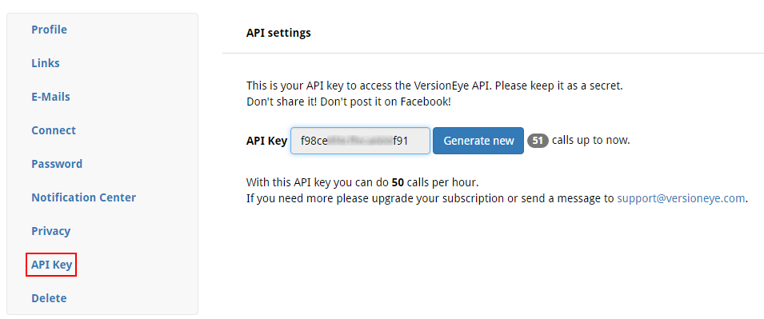
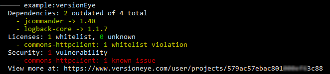

# VersionEye plug-in for [Kobalt](http://beust.com/kobalt/home/index.html)

[](http://opensource.org/licenses/BSD-3-Clause) [](https://travis-ci.org/ethauvin/kobalt-versioneye) [ ](https://bintray.com/ethauvin/maven/kobalt-versioneye/_latestVersion)

[](https://www.versioneye.com)

The plug-in will create and update projects on [VersionEye](https://www.versioneye.com/), a service that notifies you about outdated dependencies, security vulnerabilities and license violations.

To use the plug-in include the following in `Build.kt` file:

```kotlin
import net.thauvin.erik.kobalt.plugin.versioneye.*

val pl = plugins("net.thauvin.erik:kobalt-versioneye:0.4.0-beta")

val p = project {

    name = "example"
    group = "com.example"
    artifactId = name
    version = "0.1"
    
    versionEye {
    
    }
```
[View Example](https://github.com/ethauvin/kobalt-versioneye/blob/master/example/kobalt/src/Build.kt)

To create or update your project on VersionEye, you will need an API key. If you are [signed up](https://www.versioneye.com/signup), you can find your API Key [here](https://www.versioneye.com/settings/api):

[](https://www.versioneye.com/settings/api)

To create your project on VersionEye simply use your API Key as follows

```bash
./kobaltw -Dversioneye.ApiKey=YOUR_API_KEY_HERE versionEye
```

This will instruct the plug-in to create and update your project on VersionEye. Your API Key will automatically be saved in the`local.properties` file.

Upon running the above command the plug-in will output something like:

[]

The repot is based on the *Traffic Light* concept:

1. Green items are clear.
2. Yellow items may require some attention.
3. Red items will cause the build to fail.

By default the plug-in is configured to only fail on known security vulnerabilities.

## Global Configuration

You can configure the VersionEye **API Key** and **Project Key** (if you already have one) in one of two ways.

Using the command line:

``` bash
./kobaltw -Dversioneye.ApiKey=YOUR_API_KEY -Dversionkey.projectKey=YOUR_PROJECT_KEY versionEye
```
These keys will be save automatically in the `local.properties` file.

In the `local.properties` file:

```
versioneye.ApiKey=YOUR_API_KEY
versioneye.projectKey=YOUR_PROJECT_KEY
```
## Task Configuration

Parameters are configurable in the `versionEye` task:

```
versionEye {
    baseUrl = "https://www.versioneye.com/"
    colors = true
    name = ""
    org = ""
    quiet = false
    team = ""
    verbose = true
    visibility = "public"

    failOn(Fail.securityCheck)
}
```

The values are:

| Value       | Description                                                                                     | Default                       |
| :---------- | :---------------------------------------------------------------------------------------------- | :---------------------------- |
| `baseUrl`   | For VersionEye Enterprise VM to use their own url, e.g. `https://versioneye.my-company.com/`    | `https://www.versioneye.com/` |
| `colors`    | To enable (`true`) or disable (`false`) colors in the plug-in output.                           | `true`                        |
| `name`      | The name of the VersionEye project, if none are specified the Kobalt project name will be used. | *none*                        |          
| `quiet`     | To completely disable output from the plug-in.                                                  | `false`                       |
| `org`       | The VersionEye organisation, if any.                                                            | *none*                        |
| `team`      | The VersionEye team, if any.                                                                    | *none*                        |
| `vebose`    | To enable or disable extra information in the plug-in output.                                   | `true`                        |
| `visbility` | To set the project's visibility on VersionEye, either `public` or `private`                     | `public`                      |

Some of the parameters can be controlled temporarily from the command line, as follows:

```bash
./kobaltw -Dve.colors=false versionEye
./kobaltw -Dve.verbose=false versionEye
./kobaltw -Dve.quiet=true versionEye

./kobaltw -Dve.colors=false -Dve.verbose=false versionEye
```

## Failures Configuration

The `failOn` directive can be used to trigger specific failures:

```
versionEye {
    failOn(Fail.securityCheck, Fail.licensesCheck)
}
```

| Fail On                     | Description                                                                                                                                                             |
| :-------------------------- | :---------------------------------------------------------------------------------------------------------------------------------------------------------------------- |
| `Fail.dependenciesCheck`    | Will triggered a failure on outdated dependencies.                                                                                                                      |
| `Fail.licensesUnknownCheck` | Will trigger a failure on unknown licenses.                                                                                                                             |
| `Fail.licensesCheck`        | Will trigger a failure on licences whitelist violations. Licenses and components whitelists can be configured on the [VersionEye](https://www.versioneye.com/) website. |
| `Fail.securityCheck`        | Will trigger a failure on known security vulnerabilities, on by default.                                                                                                |