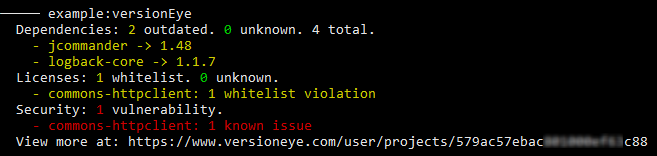

# VersionEye plug-in for [Kobalt](http://beust.com/kobalt/home/index.html)

[](http://opensource.org/licenses/BSD-3-Clause) [](https://travis-ci.org/ethauvin/kobalt-versioneye) [ ](https://bintray.com/ethauvin/maven/kobalt-versioneye/_latestVersion)

[](https://www.versioneye.com)

The plug-in will create and update projects on [VersionEye](https://www.versioneye.com/), a service that notifies you about out-dated dependencies, security vulnerabilities and license violations.

To use the plug-in include the following in `Build.kt` file:

```kotlin
import net.thauvin.erik.kobalt.plugin.versioneye.*

val pl = plugins("net.thauvin.erik:kobalt-versioneye:0.4.0-beta")

val p = project {

    name = "example"
    group = "com.example"
    artifactId = name
    version = "0.1"
    
    versionEye {
    }
```
To create or update your project on VersionEye, you will need an API key. If you are [signed up](https://www.versioneye.com/signup), you can find your API Key [here](https://www.versioneye.com/settings/api):

[](https://www.versioneye.com/settings/api)

To create your project on VersionEye simply use your API Key as follows

```bash
./kobaltw -Dversioneye.ApiKey=YOUR_API_KEY_HERE versionEye
```

This will instruct the plug-in to create and update your project on VersionEye. Your API Key will automatically be saved in the`local.properties` file.

Upon running the above command the plug-in will output something like:

[]

The repot is based on the Traffic Light concept:

1. Green items are clear.
2. Yellow items may require some attention.
3. Red items will cause the build to fail.

By default the plug-in is configured to only fail on known security vulnerability.
